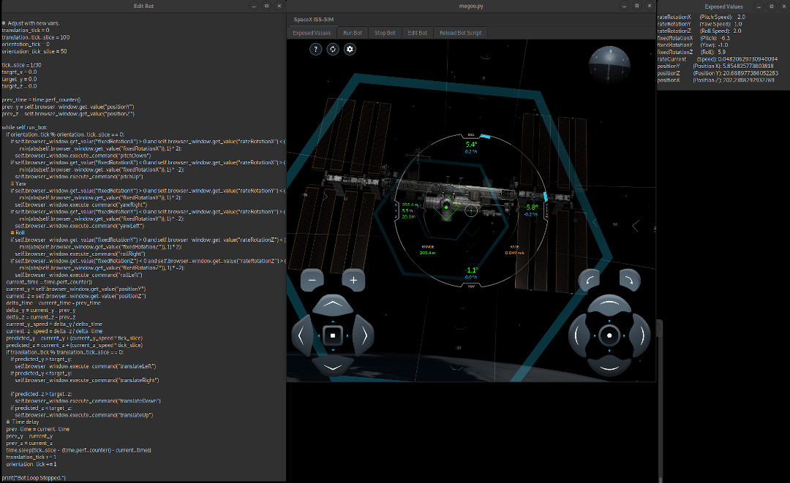

Magoo

*work in progress*

A way to automate interaction with the SpaceX iss-sim, https://iss-sim.spacex.com/

[Presentation](https://docs.google.com/presentation/d/1SEM1Wzo29rqZ_46FMFVWdpJXtDILr_dGUZm6sI2JpxM/edit?usp=sharing) I created for this application.

Edit window for your bot script
Includes live reload of the bot script (hit start bot)\
Popup window with the current exposed values\

Edit your script in your favorite text editor\
Copy and paste your script into the 'Edit script' window\
Click run bot to load your newly pasted script.\
Any errors in the script will be printed to stdout.

`python -m venv venv`

`. venv/bin/activate`

`pip install -r requirements.txt`

`python ./magoo.py`

To run the iss-sim
- run magoo
- click begin in the middle of the screen to start the simulation
- click 'Create Bot' at the top right hand corner to create the python bot.
- click 'Run Bot' to start running the bots main thread
 
Todo:
- Add a save of the bot script
- Add tabs with selections to run a different bot and values
- Finish the ISS-Sim bot so it actually docks with the space station.
- ~~Create a reload of the original bot script~~
- ~~Allow for live reload of the bot script~~
- ~~Create an edit window for the bot script~~
- ~~Live update the exposed variables~~
- ~~Create a window to display the current exposed variables~~
- ~~Expose actions for use by the bot~~
- ~~Expose variables for use by the bot~~
- ~~Generate a simple bot to start piloting the space craft~~

References:

- [Gdk keycodes](https://docs.gtk.org/gdk4/keys.html)
- [GTK Docs](https://python-gtk-3-tutorial.readthedocs.io/)
- [GTK pgi-docs Gdk 3.0](https://lazka.github.io/pgi-docs/Gdk-3.0/index.html)
- [Oh its just so simple...](https://riptutorial.com/gtk3/example/16426/simple-binding-to-a-widget-s-key-press-event)
